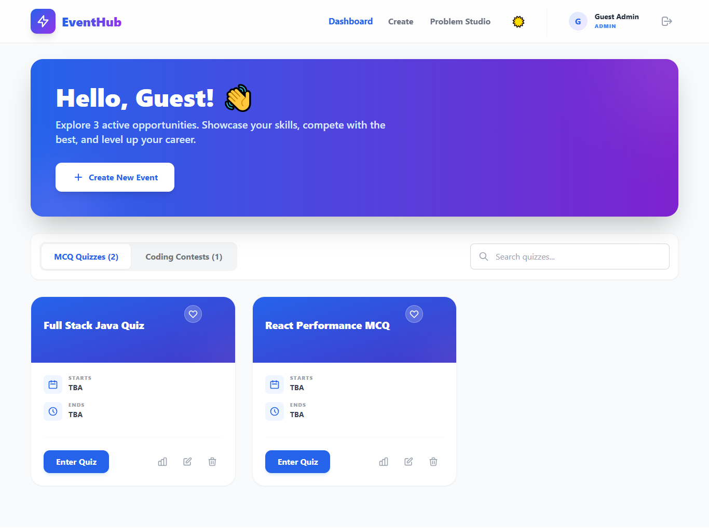
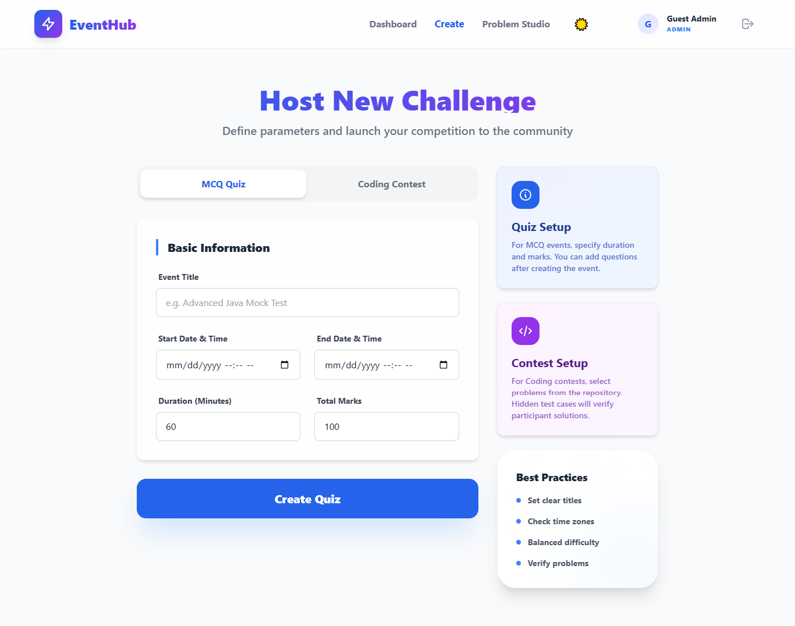
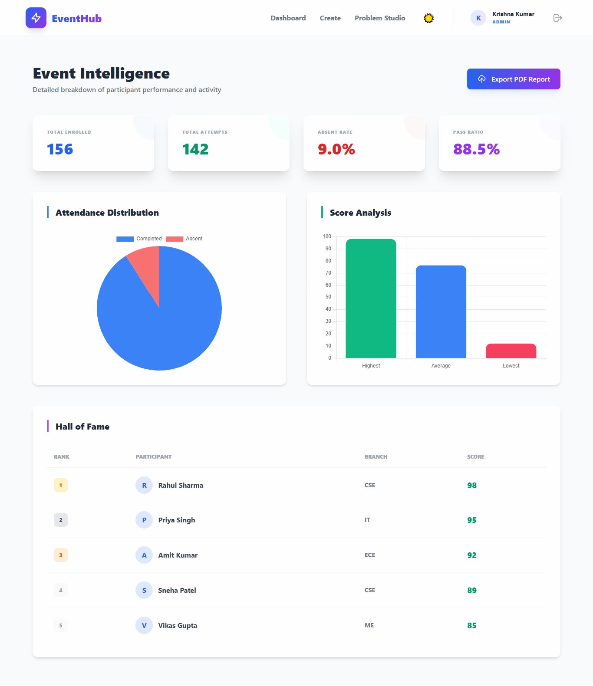
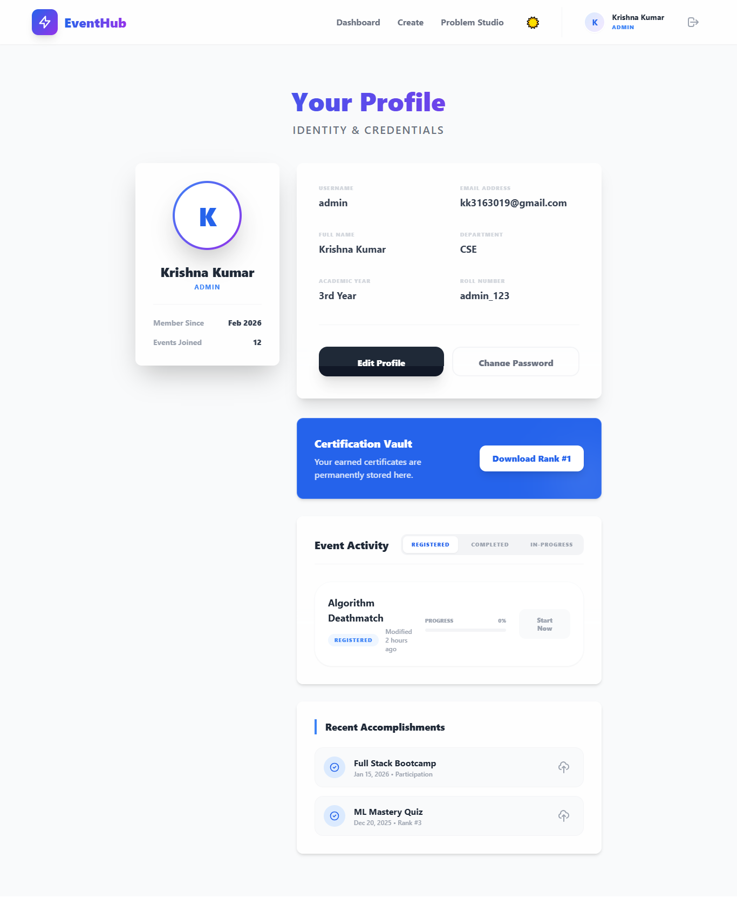
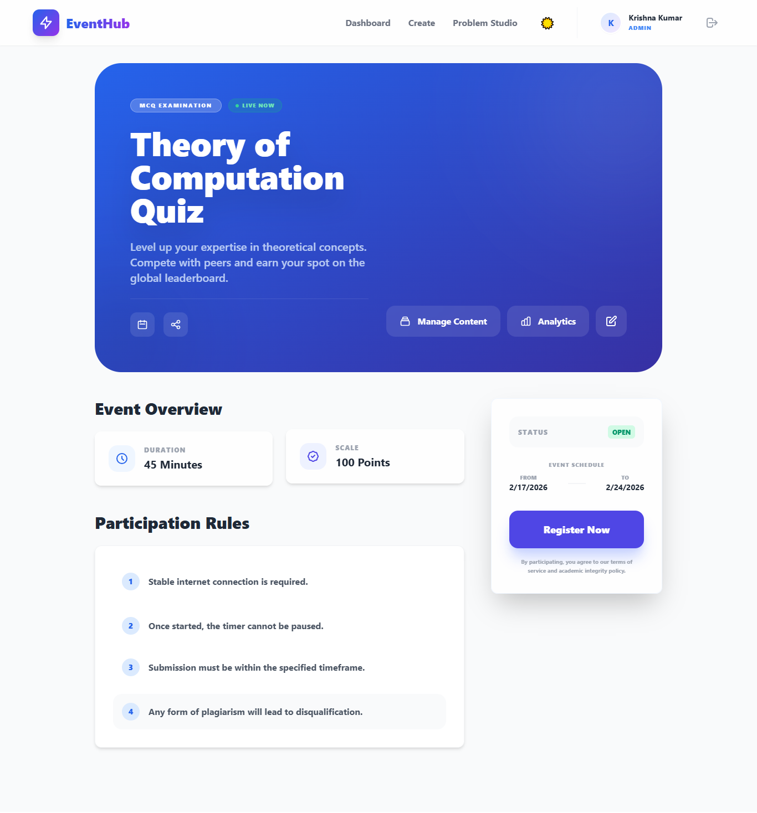

# 🚀 EventHub - Modern Event Management System

EventHub is a comprehensive, full-stack platform designed to manage and participate in technical events, including **MCQ Quizzes** and **Coding Contests**. It features a stunning, premium UI with multiple color themes and advanced management tools for both students and administrators.

---

## ✨ Features & User Guide

### 🎨 Design & Accessibility
- **Multi-Theme Support**: 
  - **How to use**: Click the ☀️/🌙 icon in the navigation bar to toggle between **Light**, **Dark**, **Midnight** (Deep Blue), and **Forest** (Green) themes.
- **Glassmorphic UI**: Modern design with blur effects.
- **Responsive Layout**: Optimized for mobile, tablet, and desktop.

### 🏆 Participant Experience
- **Smart Dashboard**: 
  - **Filtering**: Use the status tabs to view **Live**, **Upcoming**, or **Past** events.
  - **Sorting**: Order events by **Newest**, **Oldest**, or **Duration**.
  - **View Toggle**: Switch between **Grid** and **List** view for your preference.
- **Favorites System**: 
  - **How to use**: Click the ❤️ icon on any event card to save it. View your saved items using the "Favorites" filter.
- **Event Details**:
  - **Live Countdown**: See exactly how much time is left until an event starts.
  - **Calendar Export**: Click "Add to Calendar" to download an `.ics` file.
  - **Share**: Quickly copy the event URL to your clipboard.

### 🛠️ Admin & Tooling
- **Event Creation**: Form-based creation for MCQs and Coding challenges.
- **Problem Studio**: 
  - **Engineer Challenges**: Build coding problems with custom test cases and constraints.
  - **JSON Import**: Click **"Import from JSON"** to bulk-upload challenges instantly.
- **Profile Management**: Update your name, department, and track your event activity (Registered, Completed, In-Progress).

---

## 📸 Visual Tour

### 🏙️ Dashboard Overview
The central hub for all activities. Toggle themes, search for contests, and manage your favorites.


### ✍️ Creating Challenges
A streamlined interface for admins to launch new contests and quizzes.


### 📊 Analytics & Results
Detailed performance tracking for events and individual participants.


### 👤 User Profile & Activity
Monitor your progress, certifications, and manage your personal details.


### 📝 Event Registration
Seamless registration flow for upcoming quizzes and coding contests.


---

## 💻 Tech Stack

**Frontend:**
- **Framework**: React.js (Vite)
- **Styling**: Tailwind CSS & CSS Variables (Theming)
- **Routing**: React Router 6
- **State Management**: Context API (Auth & Theme)

**Backend:**
- **Framework**: Spring Boot 3
- **Database**: MongoDB
- **Security**: Spring Security (Basic Auth / JWT ready)
- **Build Tool**: Maven

---

## 🚀 Getting Started

### Prerequisites
- Node.js (v18+)
- Java 21+
- MongoDB

### 1. Installation
```bash
git clone https://github.com/krishna3163/EventProject.git
cd EventProject
```

### 2. Frontend Setup
```bash
cd event-frontend
npm install
npm run dev
```
Accessible at: `http://localhost:3000`

### 3. Backend Setup
1. Ensure MongoDB is running.
2. Configure `EventProject-main/src/main/resources/application.yaml`.
```bash
cd EventProject-main
.\mvnw.cmd spring-boot:run
```
Accessible at: `http://localhost:8080`

---

## 🤝 Contributing
Contributions are welcome! Please feel free to submit a Pull Request.

---

**Developed with ❤️ by krishna3163**
